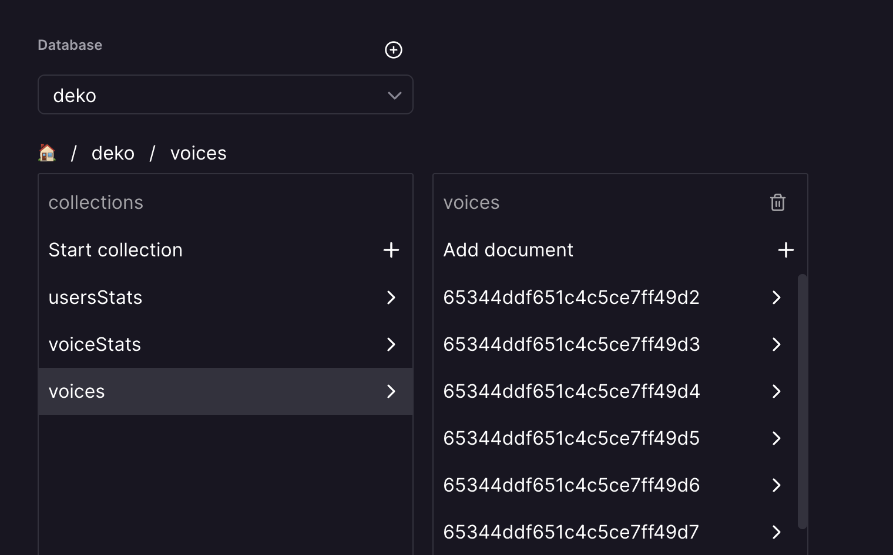
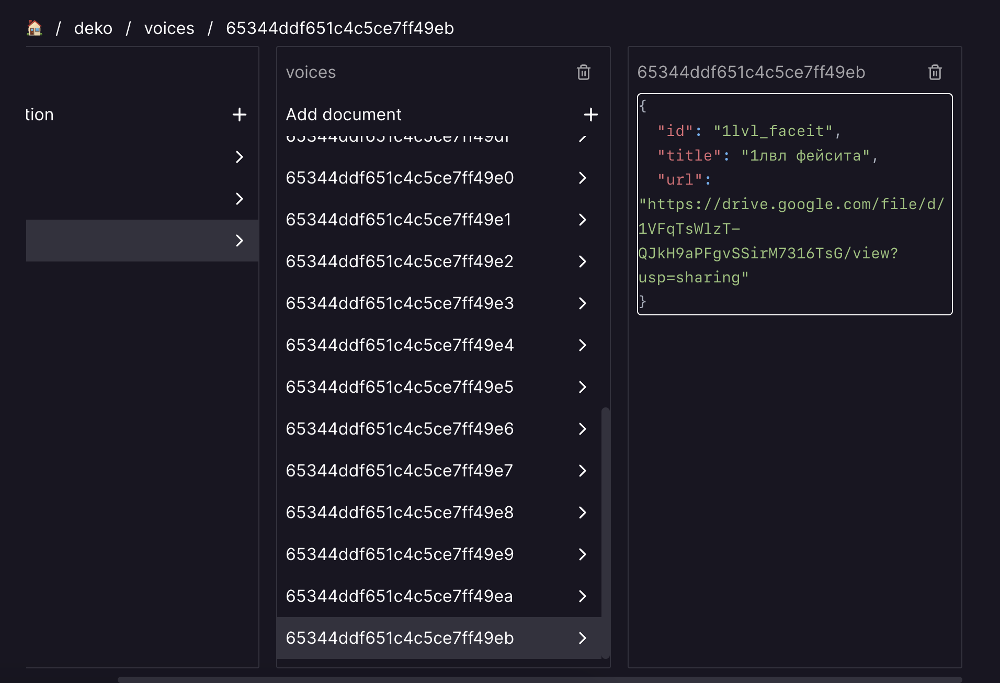

# Deko Voice Bot

Бот для отправки реплик deko от лица пользователя через [Inline Query](https://core.telegram.org/bots/features#inline-requests)

Бот позволяет просматривать весь список реплик, доступных в базе данных, а также искать нужные с помощью текстового запроса

> Ссылка на "боевого" бота: <https://t.me/dekoquotes_bot>

## Используемый стек

- Бот построен на [Deno](https://deno.com/) с использованием [TypeScript](https://www.typescriptlang.org/)
- В качестве библиотеки для взаимодействия с Telegram Bot API  используется [grammY](https://github.com/grammyjs/grammY/)
- Данные хранятся в [MongoDB](https://www.mongodb.com/) и управляются с помощью [драйвера](https://deno.land/x/mongo@v0.32.0) для Deno
- Бот хранится и работает на хостинге [Railway](https://railway.app/)

## Как работает бот

В документации Telegram Bot API описана возможность отправки голосовых сообщений с помощью Inline через `file_id` _(что немного неудобно, так как надо войсы хостить в закрытом канале и получать у каждого его ID)_ или же с помощью ссылки на .ogg файл в интернете _(что уже более удобный вариант)_

Таким образом, реплики бота находятся на Google Drive, откуда потом получаются ссылки на каждую реплику и в дальнейшем бот, скачивает файл с репликой и отправляет в Telegram

> Который позже кеширует голосовое сообщение и отправляет отправлять без необходимости повторного скачивания с Google Drive

Также у бота предусмотрено кеширование данных о репликах. Это позволяет получать необходимые реплики сразу же и обращаться к базе данных намного реже или вообще только по необходимости

## Как использовать исходники бота у себя

Чтобы заставить бота работать, необходимо скачать и установить Deno и далее, заполнить все поля для .env _(скопируйте .env.example и переименуйте в .env)_. Пройдемся немного по полям в .env:

- Поле `CREATOR_ID` является опциональным, однако он необходим, чтобы управлять некоторыми возможностями бота через личные сообщения с ним

    > На данный момент, создатель бота может только инвалидировать главный кэш голосовых, на случай если база данных была обновлена извне. Больше возможностей будут добавлены позже

- Поле `BOT_TOKEN` в представлении не нуждается, но если что, это токен бота, который можно получить у [BotFather](https://t.me/BotFather)

- Поле `MONGO_URL` определяет ссылку на инстанс MongoDB _(внешний или локальный)_. Бот далее автоматически организует структуру базы данных для работы и создаст необходимые коллекции/документы по необходимости

- Поле `STICKER_FILE_ID_FOR_DEEPLINK` тоже является опциональным и определяет ID стикера, который будет отправлен пользователю, если он нажмет на кнопку в самом вверху результатов с репликами _(т.к. это deeplink кнопка, которая игнорируется)_

Далее, когда убедились, что все установлено как надо _(проверить можно через `deno --version`)_ и все данные в .env заполнены, осталось лишь выполнить команду `deno task start` или `deno task dev`, чтобы бот перезапускался на каждое обновление файлов

Если нужно захостить бота, то можно выбрать любой хостинг, который позволяет развернуть Docker контейнер

### Добавление новых реплик

На данный момент, реплики можно добавлять только вручную в саму базу данных. Для этого нужно открыть коллекцию "voices" в базе данных "deko"



Теперь, добавляем новый документ в следующем формате:

```json
{
    // короткий и уникальный ID для query элемента (1-64 байт)
    "id": "123123",
    // название реплики, которая будет отображаться в списке
    "title": "aboba",
    // обычная ссылка на файл в Google Drive (которая позже будет автоматически сконвертирована в ссылку для прямой загрузки)
    "url": "https://drive.google.com/file/d/.../view?usp=sharing"
}
```

Примерно, у вас должен выйти такой документ:



Далее, для обновления реплик у бота, используйте команду `/invalidate` в личных сообщениях, чтобы сбросить кэш и скачать обновленные реплики на следующем вызове Inline режима

## Как контрибьютить

А зачем? Ну ладно, если так хочется, то флоу очень прост: Форк -> Новая ветка от develop -> Пулл реквест

И желательно, использовать названия для коммитов из ["Соглашений о коммитах"](https://www.conventionalcommits.org/ru/v1.0.0/), иначе коммиты будут смержены в один общий

## Лицензия

Бот распространяется по лицензии MIT. Больше деталей в файле [LICENSE](/LICENSE)
